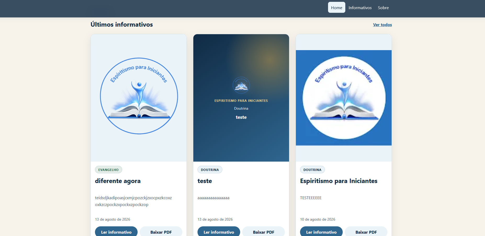
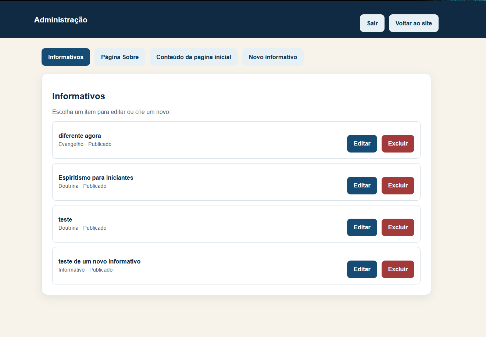
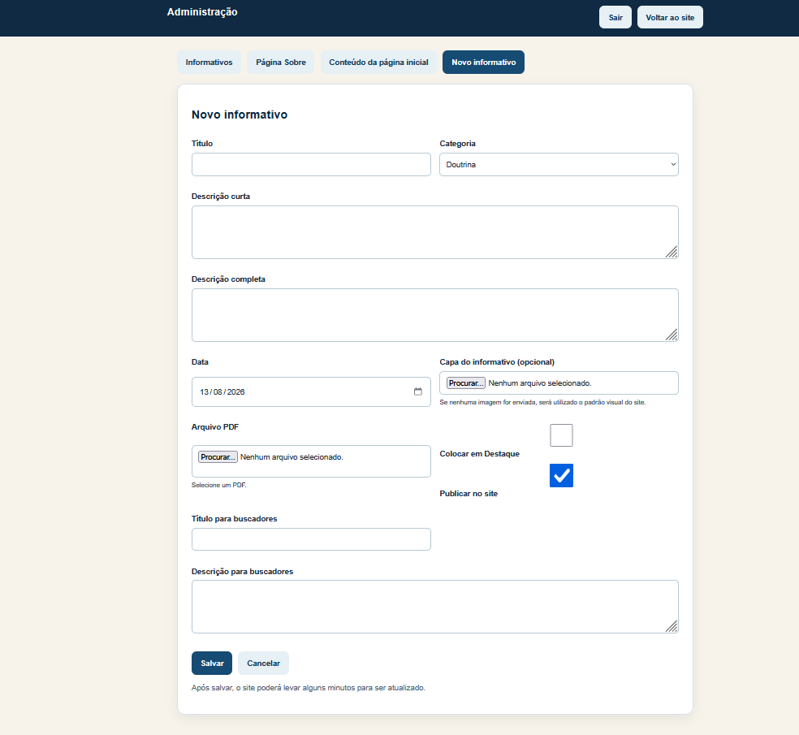

# 📚 Espiritismo para Iniciantes

<p align="center">
  <strong>Biblioteca Digital Espírita para publicação, leitura e organização de informativos.</strong>
</p>

<p align="center">
  Aplicação web completa e responsiva, com catálogo de conteúdos em PDF,
  leitor integrado e painel administrativo próprio.
</p>

<p align="center">
  <a href="https://espiritismo-para-iniciantes.pages.dev/">
    <strong>🌐 Acessar aplicação</strong>
  </a>
</p>

<br>

<p align="center">
  
</p>

---

## 📖 Sobre o projeto

O **Espiritismo para Iniciantes** é uma plataforma web desenvolvida para disponibilizar informativos e materiais de estudo em PDF de maneira simples, organizada e acessível.

O projeto foi pensado para atender dois públicos:

- 👥 **Visitantes**, que podem encontrar, pesquisar, ler e baixar os informativos;
- 📝 **Administrador**, que pode gerenciar todo o conteúdo através de um painel próprio e de fácil utilização.

Um dos principais objetivos foi permitir que o responsável pelo conteúdo pudesse administrar o site sem precisar possuir conhecimentos técnicos.

Por isso, além da aplicação pública, foi desenvolvido um **painel administrativo completo**, responsável pelo gerenciamento dos informativos e dos principais conteúdos editoriais do site.

> 🔒 O código-fonte completo da aplicação é mantido em um repositório privado.  
> Este repositório público apresenta o projeto para fins de portfólio e demonstração técnica.

---

# 🌐 Aplicação em produção

A aplicação está publicada e disponível em:

### 👉 https://espiritismo-para-iniciantes.pages.dev/

O projeto foi desenvolvido com foco em:

- simplicidade;
- facilidade de utilização;
- responsividade;
- organização dos conteúdos;
- experiência de leitura;
- segurança;
- facilidade de administração;
- manutenção e evolução da aplicação.

---

# ✨ Principais funcionalidades

## 🏠 Página inicial

A Home apresenta o projeto e os principais conteúdos disponíveis.

Entre os recursos estão:

- apresentação institucional;
- informativos em destaque;
- últimos informativos;
- acesso rápido ao catálogo;
- chamadas editoriais;
- acesso aos canais do projeto;
- layout responsivo;
- conteúdo editorial administrável.

Para manter a página organizada, a Home apresenta uma seleção limitada dos conteúdos:

- até **3 informativos em destaque**;
- até **3 informativos normais/recentes**.

Todos os demais materiais continuam disponíveis no catálogo.

<p align="center">
  
</p>

---

# 📚 Catálogo de informativos

A aplicação possui uma área dedicada à consulta dos materiais publicados.

O visitante pode:

- visualizar os informativos;
- pesquisar conteúdos;
- filtrar por categoria;
- ordenar os resultados;
- abrir um informativo;
- realizar a leitura do documento;
- baixar o PDF.

A estrutura foi preparada para continuar organizada mesmo com o crescimento da quantidade de publicações.

---

# 🔎 Pesquisa, filtros e organização

O catálogo permite localizar conteúdos utilizando pesquisa textual e filtros.

Os informativos podem ser organizados por categorias, facilitando a navegação e permitindo que o visitante encontre rapidamente os materiais relacionados ao assunto desejado.

---

# 📄 Leitor de PDF integrado

Os informativos podem ser lidos diretamente pela aplicação através de um leitor integrado.

O leitor utiliza **PDF.js** e é carregado somente quando necessário, evitando adicionar todo o peso da biblioteca ao carregamento inicial da aplicação.

Além da leitura online, o visitante também pode baixar o documento original.

<p align="center">
  
</p>

---

# 🖼️ Sistema de capas

Cada informativo pode possuir uma imagem de capa própria.

Entretanto, a utilização de uma capa é **opcional**.

Quando nenhuma imagem é enviada, a aplicação utiliza automaticamente um layout padrão baseado na identidade visual do projeto.

Dessa forma:

- o administrador não precisa criar uma imagem para cada publicação;
- nenhum informativo fica sem apresentação visual;
- a identidade do projeto é preservada;
- o catálogo permanece visualmente consistente.

---

# ⚙️ Painel administrativo próprio

Um dos principais diferenciais do projeto é o desenvolvimento de uma **área administrativa própria**.

O painel foi criado pensando principalmente na facilidade de utilização.

A proposta é permitir que o responsável pelo site consiga realizar as operações do dia a dia sem precisar conhecer programação ou a estrutura interna da aplicação.

Entre as funcionalidades disponíveis estão:

- gerenciamento de informativos;
- cadastro de novos conteúdos;
- edição de informativos;
- exclusão de informativos;
- upload de PDFs;
- upload opcional de capas;
- definição de conteúdos em destaque;
- controle de publicação;
- gerenciamento da página inicial;
- gerenciamento da página institucional.

---

## ⚙️ Gerenciamento de informativos

O painel possui uma área dedicada aos informativos cadastrados.

Nessa tela, o administrador consegue visualizar os conteúdos existentes e realizar as principais operações de gerenciamento.

É possível:

- visualizar os informativos cadastrados;
- verificar a categoria;
- verificar a situação da publicação;
- editar um conteúdo existente;
- excluir um informativo;
- acessar o cadastro de um novo material.

<p align="center">
  
</p>

---

# ➕ Cadastro de novos informativos

O cadastro foi desenvolvido para ser simples e direto.

O administrador pode informar:

- título;
- categoria;
- descrição curta;
- descrição completa;
- data;
- arquivo PDF;
- capa opcional;
- definição de destaque;
- situação da publicação;
- informações complementares para mecanismos de busca.

Após preencher os dados, basta salvar o conteúdo.

<p align="center">
  
</p>

---

# 👨‍💻 Experiência pensada para o administrador

O painel não foi desenvolvido apenas como uma interface técnica.

A experiência foi planejada considerando que o responsável pela administração pode não possuir conhecimentos de desenvolvimento de software.

O fluxo básico de publicação é simples:

```text
Acessar o painel
       ↓
Cadastrar o informativo
       ↓
Selecionar o PDF
       ↓
Adicionar uma capa (opcional)
       ↓
Definir publicação e destaque
       ↓
Salvar
       ↓
Conteúdo disponibilizado no site
```

Após uma operação bem-sucedida, o administrador recebe uma confirmação clara.

O sistema também trata situações como:

- prevenção de envios duplicados;
- preservação dos dados em caso de erro;
- limpeza do formulário após cadastro;
- confirmação de exclusão;
- feedback durante o salvamento;
- aviso quando uma atualização pode levar alguns minutos para aparecer publicamente.

---

# 🏠 Gerenciamento da página inicial

Os principais textos editoriais da Home também podem ser alterados pelo painel administrativo.

Entre os conteúdos administráveis estão:

- título principal;
- descrição principal;
- identificação das seções;
- título da seção de destaques;
- título da seção de novidades;
- mensagens editoriais;
- chamadas para o catálogo;
- textos de apoio.

Dessa forma, alterações editoriais podem ser realizadas sem modificar a aplicação.

---

# ℹ️ Gerenciamento da página Sobre

O conteúdo institucional da página **Sobre** também pode ser atualizado através do painel.

É possível administrar informações como:

- título;
- subtítulo;
- apresentação;
- títulos de seções;
- textos institucionais.

---

# 🏗️ Arquitetura

A aplicação utiliza uma arquitetura baseada em serviços serverless.

Visão simplificada:

```text
                        ┌─────────────────────┐
                        │      Visitante      │
                        └──────────┬──────────┘
                                   │
                                   ▼
                        ┌─────────────────────┐
                        │     Angular App     │
                        │  Cloudflare Pages   │
                        └──────────┬──────────┘
                                   │
                 ┌─────────────────┴─────────────────┐
                 │                                   │
                 ▼                                   ▼
        Aplicação pública                   Área administrativa
                 │                                   │
        ┌────────┴────────┐                          ▼
        │                 │                 Cloudflare Workers
        ▼                 ▼                          │
   Informativos       PDF / imagens                  ▼
        │                                    Serviços serverless
        ▼
   Leitor PDF.js
```

Essa arquitetura permite separar a experiência pública das operações administrativas e utilizar recursos serverless para processamento e controle de estado.

---

# 🛠️ Tecnologias utilizadas

## 🖥️ Front-end

- **Angular 21**
- **TypeScript**
- HTML5
- CSS3
- Angular Standalone Components
- RxJS

## 📄 Documentos

- **PDF.js**

## ☁️ Backend / Serverless

- **Cloudflare Workers**
- **Cloudflare Durable Objects**
- JavaScript
- ECMAScript Modules

## 🚀 Hospedagem

- **Cloudflare Pages**

## 📦 Conteúdo

- conteúdo estruturado;
- processamento automatizado;
- geração de JSON para consumo pelo front-end;
- versionamento do conteúdo.

## 🧪 Qualidade

- testes automatizados;
- validação de builds;
- Prettier;
- auditoria de dependências;
- validação automatizada de conteúdo.

---

# 🔐 Segurança

Como a aplicação possui uma área administrativa capaz de modificar conteúdos públicos, a segurança foi tratada como parte importante da arquitetura.

Foram implementadas diferentes camadas de proteção.

## 🔑 Autenticação

A área administrativa possui autenticação própria e gerenciamento seguro de sessão.

Entre os controles implementados estão:

- derivação segura de credenciais;
- sessões autenticadas;
- identificadores de sessão aleatórios;
- expiração;
- logout com revogação de sessão;
- cookies protegidos.

---

## 🍪 Proteção das sessões

As sessões administrativas possuem controle server-side e podem ser revogadas.

São utilizados mecanismos como:

- `HttpOnly`;
- `Secure`;
- `SameSite=Strict`;
- expiração controlada;
- armazenamento seguro dos identificadores de sessão.

---

## 🚦 Proteção contra força bruta

As tentativas de autenticação possuem controle de frequência.

O mecanismo utiliza infraestrutura distribuída para limitar sucessivas tentativas de login e reduzir o risco de ataques de força bruta.

---

## 🛡️ Proteção contra CSRF

Operações administrativas que modificam informações possuem proteção contra **Cross-Site Request Forgery (CSRF)**.

---

## 🌐 Validação de origem

Requisições administrativas passam por validações de origem antes da execução de operações protegidas.

---

## 📁 Proteção de caminhos

Dados utilizados para identificar conteúdos e arquivos são validados antes de qualquer operação.

Tentativas de manipulação indevida de caminhos são rejeitadas.

---

## 📤 Segurança dos uploads

Os arquivos enviados pelo painel não são validados somente pelo nome ou extensão.

A aplicação verifica diferentes características do arquivo, incluindo:

- extensão;
- tipo MIME;
- assinatura binária;
- tamanho;
- nome;
- destino permitido.

Entre os formatos de imagem aceitos estão:

- JPEG;
- PNG;
- WebP.

Para documentos:

- PDF.

Arquivos incompatíveis são rejeitados antes da persistência.

---

## 📏 Controle do tamanho das requisições

A aplicação também possui limites de tamanho para requisições e uploads.

A leitura dos dados é controlada para impedir o processamento indiscriminado de requisições excessivamente grandes.

---

# 🧪 Testes automatizados

O projeto possui uma suíte de testes cobrindo diferentes camadas da aplicação.

Entre os cenários testados estão:

- componentes Angular;
- carregamento de conteúdo;
- seleção de informativos;
- comportamento da Home;
- conteúdo sem capa;
- processamento de conteúdo;
- painel administrativo;
- autenticação;
- sessões;
- logout;
- CSRF;
- rate limiting;
- uploads;
- validação de arquivos;
- limites de requisição;
- validação de identificadores;
- proteção de caminhos;
- endpoints administrativos;
- integração das funções serverless.

---

# 🔄 Fluxo de validação

Antes da publicação de alterações, diferentes verificações podem ser executadas:

```text
Testes Angular
      ↓
Testes do backend
      ↓
Testes das funções serverless
      ↓
Processamento de conteúdo
      ↓
Build da aplicação
      ↓
Build do backend
      ↓
Validação de código
      ↓
Auditoria de dependências
```

Esse processo ajuda a reduzir regressões e aumenta a confiabilidade das alterações.

---

# ⚡ Performance

Algumas decisões foram tomadas pensando também no desempenho da aplicação.

Entre elas:

- carregamento sob demanda do PDF.js;
- separação entre aplicação pública e recursos administrativos;
- geração antecipada dos conteúdos públicos;
- redução do processamento necessário para visitantes;
- utilização de infraestrutura serverless;
- distribuição através da rede da Cloudflare.

---

# 📱 Responsividade

A aplicação foi projetada para funcionar em diferentes dispositivos:

- 🖥️ computadores;
- 💻 notebooks;
- 📱 smartphones;
- 📲 tablets.

A interface adapta os conteúdos, cards, navegação e páginas para diferentes tamanhos de tela.

---

# ♿ Acessibilidade

Durante o desenvolvimento também foram consideradas práticas relacionadas à acessibilidade e experiência do usuário.

Entre elas:

- estrutura semântica;
- mensagens de estado;
- feedback de operações;
- navegação compreensível;
- legibilidade;
- contraste;
- adaptação para diferentes telas;
- estados de carregamento;
- prevenção de ações duplicadas.

---

# 🚀 Infraestrutura

A aplicação utiliza serviços da Cloudflare para hospedagem e execução das funcionalidades serverless.

```text
Cloudflare
│
├── Pages
│   └── Aplicação Angular
│
├── Workers
│   └── Operações administrativas
│
└── Durable Objects
    └── Estado distribuído
```

Essa abordagem reduz a necessidade de manter servidores tradicionais e permite uma arquitetura distribuída.

---

# 🧠 Principais desafios

O projeto envolveu desafios que vão além da construção da interface.

## 👤 Administração por usuário não técnico

O responsável pelo conteúdo precisava conseguir administrar o site sem conhecimentos de desenvolvimento.

Isso influenciou diretamente decisões relacionadas a:

- UX;
- mensagens;
- formulários;
- confirmação de operações;
- tratamento de erros;
- automação dos processos internos.

---

## 📚 Conteúdo estruturado

Foi criada uma estratégia para manter os conteúdos organizados e transformá-los em uma estrutura otimizada para consumo pela aplicação pública.

---

## 📤 Upload seguro

Como o painel permite o envio de documentos e imagens, foi necessário criar uma camada de validação que não confiasse apenas nas informações fornecidas pelo navegador.

---

## 🔐 Sessões em ambiente serverless

A autenticação precisava funcionar corretamente em uma arquitetura distribuída.

Foi necessário implementar gerenciamento de estado apropriado para sessões e controles de segurança.

---

## 🚦 Rate limiting distribuído

O controle de tentativas de autenticação também precisava funcionar em um ambiente sem servidor tradicional.

Foi utilizada infraestrutura com estado distribuído para solucionar esse problema.

---

## 📄 Performance do PDF.js

O PDF.js oferece uma experiência completa de leitura, mas possui um custo significativo de bundle.

A solução adotada foi carregar o leitor somente quando o visitante realmente acessa um documento.

---

## 🔄 Experiência de publicação

Uma alteração administrativa pode levar algum tempo até estar disponível na aplicação pública.

O painel foi preparado para comunicar corretamente essa situação sem apresentar uma falha falsa ao administrador.

---

# 📈 Evolução do projeto

O projeto foi construído de maneira incremental.

```text
Interface pública
       ↓
Catálogo de informativos
       ↓
Pesquisa e filtros
       ↓
Leitor de PDF
       ↓
Conteúdo estruturado
       ↓
Painel administrativo
       ↓
Gerenciamento de informativos
       ↓
Upload de PDFs e imagens
       ↓
Gerenciamento da Home
       ↓
Gerenciamento da página Sobre
       ↓
Autenticação
       ↓
Sessões revogáveis
       ↓
Rate limiting
       ↓
Hardening de segurança
       ↓
Testes e auditorias
       ↓
Preparação para produção
```

---

# 💡 O que este projeto demonstra

O **Espiritismo para Iniciantes** reúne diferentes áreas do desenvolvimento de software em uma única aplicação.

## 🎨 Front-end

- Angular;
- TypeScript;
- componentes;
- serviços;
- formulários;
- responsividade;
- experiência do usuário;
- carregamento sob demanda.

## ⚙️ Backend

- APIs;
- autenticação;
- gerenciamento de sessão;
- processamento de requisições;
- validação;
- upload de arquivos.

## 🔐 Segurança

- autenticação;
- sessões revogáveis;
- CSRF;
- rate limiting;
- validação de origem;
- proteção de caminhos;
- validação binária de arquivos;
- controle do tamanho de requisições.

## ☁️ Infraestrutura

- Cloudflare Pages;
- Cloudflare Workers;
- Durable Objects;
- arquitetura serverless.

## 🧪 Engenharia de software

- testes automatizados;
- separação de responsabilidades;
- documentação;
- validação de builds;
- auditoria de dependências;
- evolução incremental;
- tratamento de erros;
- preocupação com segurança.

---

# 📸 Screenshots

## 🏠 Página inicial

A página inicial apresenta a identidade do projeto e direciona o visitante aos principais conteúdos.


---

## ⚙️ Gerenciamento de informativos

A área administrativa centraliza os informativos cadastrados e permite editar, excluir e acompanhar a situação de publicação dos conteúdos.


---

## ➕ Cadastro de novo informativo

O formulário administrativo permite cadastrar um novo material, selecionar o PDF, adicionar uma capa opcional e definir as opções de publicação.


---

## 📄 Leitor de PDF

Os documentos podem ser lidos diretamente na aplicação através do leitor integrado.


---

# 📂 Estrutura deste repositório

Este repositório é utilizado como apresentação pública do projeto.

```text
PROJETO-ESPIRITISMO-PARA-INICIANTES/
│
├── docs/
│   └── images/
│       ├── home.png
│       ├── informativos.png
│       ├── novo-informativo.png
│       └── pdfs.png
│
└── README.md
```

O código-fonte completo permanece separado deste repositório de apresentação.

---

# 🔒 Código-fonte

O código-fonte completo da aplicação é mantido em um **repositório privado**.

Esta decisão permite utilizar este repositório como uma apresentação técnica e visual do projeto sem disponibilizar publicamente toda a implementação da aplicação e de sua infraestrutura administrativa.

A aplicação real pode ser acessada em:

### 🌐 https://espiritismo-para-iniciantes.pages.dev/

---

# 👨‍💻 Autor

**Ewerton Barbosa**

Desenvolvedor com atuação em desenvolvimento Front-end e experiência com Angular, TypeScript e desenvolvimento de aplicações web.

O **Espiritismo para Iniciantes** foi desenvolvido como um projeto completo, envolvendo:

- desenvolvimento Front-end;
- backend serverless;
- arquitetura;
- segurança;
- infraestrutura;
- testes;
- experiência do usuário;
- administração de conteúdo.

---

# 🤝 Objetivo do projeto

Além de atender à necessidade real de disponibilização dos informativos, o projeto também representa a aplicação prática de conceitos modernos de desenvolvimento web.

Ele demonstra a construção de uma solução partindo da necessidade do usuário até a aplicação em produção, passando por:

**produto → interface → desenvolvimento → backend → segurança → testes → infraestrutura → produção**

---

<p align="center">
  <strong>Espiritismo para Iniciantes</strong>
</p>

<p align="center">
  Conhecimento que acolhe e inspira.
</p>

<p align="center">
  <a href="https://espiritismo-para-iniciantes.pages.dev/">
    🌐 Acessar o projeto
  </a>
</p>
